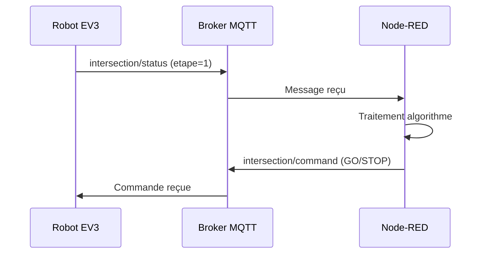

# 🚦 VA55 - Contrôle d'Intersection Coopératif
## UTBM - Master VASA - TP MQTT

Système de gestion d'intersection pour robots EV3 Mindstorms utilisant MQTT et Node-RED.

---

## 📋 Table des Matières

1. [Architecture](#architecture)
2. [Lancement Rapide](#lancement-rapide)
3. [Code EV3](#code-ev3)
4. [Tests de Simulation](#tests-de-simulation)
5. [Contrôleur Node-RED](#contrôleur-node-red)
6. [Algorithmes](#algorithmes)
7. [Protocole MQTT](#protocole-mqtt)

---

## 🏗️ Architecture

```
┌─────────────────────────────────────────────────────────────┐
│                        SYSTÈME VA55                          │
├─────────────────────────────────────────────────────────────┤
│                                                              │
│   ┌──────────┐         ┌──────────┐         ┌──────────┐   │
│   │  Robot   │  MQTT   │ Mosquitto│  MQTT   │ Node-RED │   │
│   │   EV3    │◄───────►│  Broker  │◄───────►│Controller│   │
│   │  (×N)    │         │ (Docker) │         │ (Docker) │   │
│   └──────────┘         └──────────┘         └──────────┘   │
│        │                                          │         │
│        │                                          │         │
│        ▼                                          ▼         │
│   ┌──────────┐                            ┌──────────────┐  │
│   │  Piste   │                            │  Dashboard   │  │
│   │  en 8    │                            │  Web UI      │  │
│   └──────────┘                            └──────────────┘  │
│                                                              │
└─────────────────────────────────────────────────────────────┘
```

### Flux de Données



---

## 🚀 Lancement Rapide

### Prérequis
- Docker & Docker Compose
- Python 3.8+ (pour les tests)
- Pybricks (pour le code EV3)

### Démarrage des Services

```bash
# Cloner le projet
cd /path/to/TP_MQTT

# Lancer les conteneurs
docker compose up -d

# Vérifier le statut
docker compose ps

# Voir les logs
docker compose logs -f nodered
```

### URLs Importantes

| Service | URL | Description |
|---------|-----|-------------|
| **Dashboard** | http://localhost:1880/ui | Interface de contrôle |
| **Éditeur Node-RED** | http://localhost:1880 | Configuration des flows |
| **Broker MQTT** | localhost:1883 | Connexion MQTT |

### Arrêt

```bash
docker compose down
```

---

## 🤖 Code EV3

### Structure

```
code_ev3/
├── main.py      # Logique principale du robot
└── config.py    # Configuration centralisée
```

### Configuration (`config.py`)

```python
# =============================================================================
# MQTT - Connexion au broker
# =============================================================================
BROKER_IP = "192.168.1.100"    # ⚠️ À MODIFIER selon votre réseau
BROKER_PORT = 1883
TOPIC_STATUS = "intersection/status"
TOPIC_COMMAND = "intersection/command"

# =============================================================================
# Identification Robot
# =============================================================================
ROBOT_ID = "R1"                # Nom unique du robot
VOIE = "A"                     # "A" ou "B"

# =============================================================================
# Paramètres Physiques
# =============================================================================
WHEEL_DIAMETER = 56            # mm
AXLE_TRACK = 120               # mm

# =============================================================================
# Capteurs
# =============================================================================
WHITE_REFLECTION = 60          # Valeur capteur sur blanc
BLACK_REFLECTION = 10          # Valeur capteur sur noir
MIDDLE_REFLECTION = 40         # Point milieu pour le suivi de ligne

# =============================================================================
# PID - Suivi de Ligne
# =============================================================================
KP = 1.2                       # Proportionnel
KI = 0.1                       # Intégral
KD = 0.001                     # Dérivé
COMMAND_FACTOR = 0.5           # Facteur d'atténuation
MAX_SUM_ERROR = 500            # Anti-windup

# =============================================================================
# Navigation
# =============================================================================
BASE_SPEED = 100               # mm/s
LOOP_INTERVAL = 50             # ms

# =============================================================================
# Peloton
# =============================================================================
OBSTACLE_STOP_DISTANCE = 120   # mm - Distance d'arrêt derrière un robot
```

### Logique Principale (`main.py`)

Le robot suit un cycle de **3 étapes** basé sur la détection de lignes rouges :

```
┌─────────────────────────────────────────────────────────────┐
│                    CYCLE DU ROBOT EV3                        │
├─────────────────────────────────────────────────────────────┤
│                                                              │
│    LIGNE 1          LIGNE 2              LIGNE 3             │
│   (Entrée)          (Arrêt)              (Sortie)            │
│      │                 │                    │                │
│      ▼                 ▼                    ▼                │
│   ┌─────┐          ┌─────┐              ┌─────┐             │
│   │etape│          │etape│              │etape│             │
│   │ =1  │─────────►│ =2  │─────────────►│ =3  │             │
│   └─────┘          └─────┘              └─────┘             │
│      │                 │                    │                │
│      │           ┌─────┴─────┐              │                │
│      │           │           │              │                │
│      │        GO reçu?    Non reçu?         │                │
│      │           │           │              │                │
│      │           ▼           ▼              │                │
│      │      PASS-THROUGH   ARRÊT            │                │
│      │                    (Attente GO)      │                │
│      │                        │             │                │
│      │                        │             │                │
│      └────────────────────────┴─────────────┘                │
│                                                              │
└─────────────────────────────────────────────────────────────┘
```

### Messages MQTT Envoyés

```json
{
  "id": "R1",
  "voie": "A",
  "etape": 2,
  "cause": "marker_stop",
  "dist_us": 9999
}
```

| Champ | Description |
|-------|-------------|
| `id` | Identifiant unique du robot |
| `voie` | "A" ou "B" |
| `etape` | 1 (entrée), 2 (arrêt), 3 (sortie) |
| `cause` | `marker_entry`, `marker_stop`, `pass_through`, `marker_exit`, `obstacle` |
| `dist_us` | Distance ultrason (mm) |

---

## 🧪 Tests de Simulation

### Lancement

```bash
cd tests

# Test FIFO (défaut)
python test_unified.py --mode FIFO

# Test FEU TRICOLORE
python test_unified.py --mode FEU

# Test PELOTON
python test_unified.py --mode PELOTON
```

### Arguments

| Argument | Défaut | Description |
|----------|--------|-------------|
| `--mode` | FIFO | Algorithme: `FIFO`, `FEU`, `PELOTON` |
| `--robots` | 4 | Nombre de robots à simuler |
| `--stagger` | 2.0 | Décalage (secondes) entre les départs |
| `--sequential` | - | Exécuter un robot à la fois |
| `--timeout` | 30.0 | Timeout par robot (secondes) |

### Exemples

```bash
# 6 robots en mode FIFO avec décalage de 3s
python test_unified.py --mode FIFO --robots 6 --stagger 3

# Test séquentiel (1 robot à la fois) pour debug
python test_unified.py --mode FEU --sequential

# Timeout court pour tests rapides
python test_unified.py --mode PELOTON --timeout 15
```

### Interprétation des Logs

```
[14:41:29.157] R1_A 📤 Envoi: etape=1 cause=marker_entry
[BROKER→] R1_A: GO                    ← Commande reçue du broker
[14:41:29.200] R1_A 🟢 GO REÇU!
[14:41:31.158] R1_A ⚡ PASS-THROUGH   ← Robot ne s'arrête pas (pré-autorisé)
[14:41:32.162] R1_A ✅ TERMINÉ
```

### Améliorer les Tests

Pour ajouter un nouveau scénario de test, modifiez `test_unified.py` :

```python
# Créer une configuration personnalisée
runner = TestRunner("FIFO", num_robots=8)

# Modifier le comportement du robot dans SimpleRobot.run()
```

---

## 🎛️ Contrôleur Node-RED

### Structure des Flows

```
┌─────────────────────────────────────────────────────────────┐
│                     NODE-RED FLOWS                           │
├─────────────────────────────────────────────────────────────┤
│                                                              │
│   ┌───────────┐     ┌─────────────────────┐     ┌────────┐ │
│   │ MQTT IN   │────►│ Multi-Mode          │────►│MQTT OUT│ │
│   │ (status)  │     │ Controller          │     │(command)│ │
│   └───────────┘     │                     │     └────────┘ │
│                     │ ┌─────────────────┐ │                 │
│   ┌───────────┐     │ │ Logique:        │ │     ┌────────┐ │
│   │ Timer     │────►│ │ - FEU           │ │────►│Dashboard│ │
│   │ (1s tick) │     │ │ - FIFO          │ │     │ Update  │ │
│   └───────────┘     │ │ - PELOTON       │ │     └────────┘ │
│                     │ └─────────────────┘ │                 │
│   ┌───────────┐     │                     │                 │
│   │ Mode      │────►│                     │                 │
│   │ Selector  │     └─────────────────────┘                 │
│   └───────────┘                                             │
│                                                              │
└─────────────────────────────────────────────────────────────┘
```

### État Global

```javascript
state = {
    intersection: "LIBRE" | "OCCUPE",
    queue: [],           // FIFO: liste d'attente
    file_attente: [],    // FEU: robots en attente
    robots: {},          // Tous les robots connus
    phase: 0,            // FEU: phase actuelle (0-3)
    timer: 0,            // FEU: compteur secondes
    feu: { A: "VERT", B: "ROUGE" },
    queue_voie_A: 0,     // PELOTON: distance queue
    queue_voie_B: 0
}
```

---

## 🔄 Algorithmes

### 1. 🚦 FEU TRICOLORE (Temporel)

Alternance automatique des feux basée sur un timer.

```
┌─────────────────────────────────────────────────────────────┐
│                    ALGORITHME FEU                            │
├─────────────────────────────────────────────────────────────┤
│                                                              │
│   Phase 0          Phase 1         Phase 2        Phase 3    │
│   VERT A          ROUGE TOUT       VERT B        ROUGE TOUT  │
│   ROUGE B                          ROUGE A                   │
│     │                 │               │               │      │
│     │   10 sec        │   3 sec       │   10 sec      │      │
│     └────────────────►├──────────────►├──────────────►│      │
│                       │               │               │      │
│                       │               │               │      │
│                       ▼               ▼               ▼      │
│                   SÉCURITÉ        SÉCURITÉ        RETOUR     │
│                                                    Phase 0   │
│                                                              │
└─────────────────────────────────────────────────────────────┘
```

**Logique :**
1. Timer tick chaque seconde
2. Si durée phase atteinte → changer de phase
3. Nouvelle phase VERT → débloquer robots en attente sur cette voie

**Code clé :**
```javascript
// Événement Timer
if (msg.topic === "timer_tick" && mode === "FEU") {
    state.timer++;
    if (state.timer >= duree_phase) {
        state.phase = (state.phase + 1) % 4;
        state.timer = 0;
    }
}

// Robot à étape 2
if (state.feu[voie] === "VERT") {
    commands.push({ target_id: robot_id, action: "GO" });
} else {
    state.file_attente.push(robot_id);  // Attendre
}
```

---

### 2. 📋 FIFO (Premier Arrivé, Premier Servi)

File d'attente avec pré-réservation à l'entrée.

```
┌─────────────────────────────────────────────────────────────┐
│                    ALGORITHME FIFO                           │
├─────────────────────────────────────────────────────────────┤
│                                                              │
│   ÉTAPE 1 (Entrée)                                          │
│   ┌─────────────────────────────────────────────────────┐   │
│   │ Ajouter robot à la queue                            │   │
│   │ Si LIBRE et premier de queue → GO (pré-réservation) │   │
│   └─────────────────────────────────────────────────────┘   │
│                         │                                    │
│                         ▼                                    │
│   ÉTAPE 2 (Arrêt)                                           │
│   ┌─────────────────────────────────────────────────────┐   │
│   │ Si LIBRE et premier → GO                            │   │
│   │ Sinon → Attendre (pas de commande)                  │   │
│   └─────────────────────────────────────────────────────┘   │
│                         │                                    │
│                         ▼                                    │
│   ÉTAPE 3 (Sortie)                                          │
│   ┌─────────────────────────────────────────────────────┐   │
│   │ Retirer de la queue                                 │   │
│   │ intersection = LIBRE                                │   │
│   │ Si queue non vide → GO au suivant                   │   │
│   └─────────────────────────────────────────────────────┘   │
│                                                              │
└─────────────────────────────────────────────────────────────┘
```

**Code clé :**
```javascript
// Étape 1 - Entrée
if (!state.queue.includes(robot_id)) {
    state.queue.push(robot_id);
}
if (state.intersection === "LIBRE" && state.queue[0] === robot_id) {
    commands.push({ target_id: robot_id, action: "GO" });
    state.intersection = "OCCUPE";
}

// Étape 3 - Sortie
state.queue = state.queue.filter(id => id !== robot_id);
state.intersection = "LIBRE";
if (state.queue.length > 0) {
    commands.push({ target_id: state.queue[0], action: "GO" });
    state.intersection = "OCCUPE";
}
```

---

### 3. 🚗 PELOTON (Inférence de Distance)

Priorité basée sur la distance estimée à la ligne d'arrêt.

```
┌─────────────────────────────────────────────────────────────┐
│                   ALGORITHME PELOTON                         │
├─────────────────────────────────────────────────────────────┤
│                                                              │
│   PHASE 1: Inférence de distance                            │
│   ┌─────────────────────────────────────────────────────┐   │
│   │ cause=obstacle  → distance = queue_voie + 35cm      │   │
│   │ cause=marker_entry → distance = 100 (loin)          │   │
│   │ etape=2 → distance = 0 (à la ligne)                 │   │
│   └─────────────────────────────────────────────────────┘   │
│                         │                                    │
│                         ▼                                    │
│   PHASE 2: Tri                                              │
│   ┌─────────────────────────────────────────────────────┐   │
│   │ Trier tous les robots par distance croissante       │   │
│   │ Leader = robot avec distance la plus petite         │   │
│   └─────────────────────────────────────────────────────┘   │
│                         │                                    │
│                         ▼                                    │
│   PHASE 3: Décision                                         │
│   ┌─────────────────────────────────────────────────────┐   │
│   │ Si LIBRE et leader.distance == 0 → GO au leader     │   │
│   └─────────────────────────────────────────────────────┘   │
│                                                              │
└─────────────────────────────────────────────────────────────┘
```

---

## 📡 Protocole MQTT

### Topics

| Topic | Direction | Description |
|-------|-----------|-------------|
| `intersection/status` | EV3 → Node-RED | État du robot |
| `intersection/command` | Node-RED → EV3 | Commandes |

### Format Status (Robot → Contrôleur)

```json
{
  "id": "R1",
  "voie": "A",
  "etape": 2,
  "cause": "marker_stop",
  "dist_us": 150
}
```

### Format Command (Contrôleur → Robot)

```json
{
  "target_id": "R1",
  "action": "GO"
}
```

### Actions Possibles

| Action | Description |
|--------|-------------|
| `GO` | Autorisation de passage |
| `STOP` | Ordre d'arrêt |
| `RESET` | Réinitialisation |

---

## 📂 Structure du Projet

```
TP_MQTT/
├── docker-compose.yml      # Configuration Docker
├── README.md               # Cette documentation
├── protocol.md             # Détails du protocole
│
├── code_ev3/               # Code robot EV3
│   ├── main.py             # Logique principale
│   ├── config.py           # Configuration
│   └── README.md           # Doc spécifique EV3
│
├── nodered/                # Configuration Node-RED
│   └── flows.json          # Flows et logique
│
├── mosquitto/              # Configuration MQTT
│   └── mosquitto.conf
│
└── tests/                  # Tests de simulation
    └── test_unified.py     # Simulateur de robots
```

---

## 🔧 Dépannage

### Le broker ne démarre pas
```bash
docker compose logs mosquitto
```

### Node-RED ne charge pas les flows
```bash
docker compose restart nodered
```

### Les robots ne reçoivent pas les commandes
1. Vérifier que le mode est sélectionné dans le dashboard
2. Vérifier la connexion MQTT: `docker compose logs nodered | grep MQTT`

### Test timeout
- Augmenter le stagger: `--stagger 5`
- Vérifier que Node-RED est en mode correct

---

## 👥 Auteurs

- **VA55 - UTBM**
- Master VASA - Véhicules Autonomes et Systèmes Avancés

---

## 📜 Licence

Projet éducatif - UTBM
